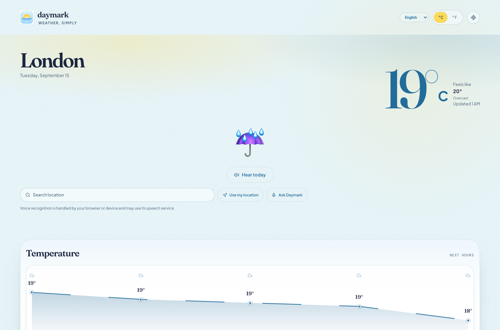
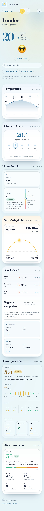
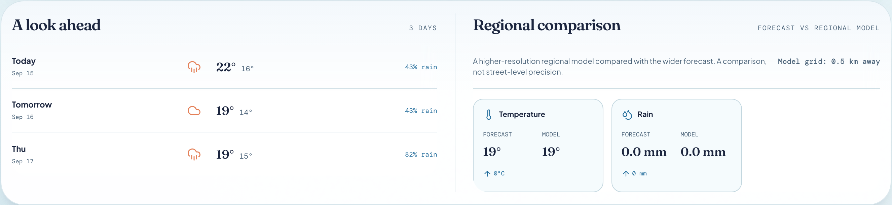
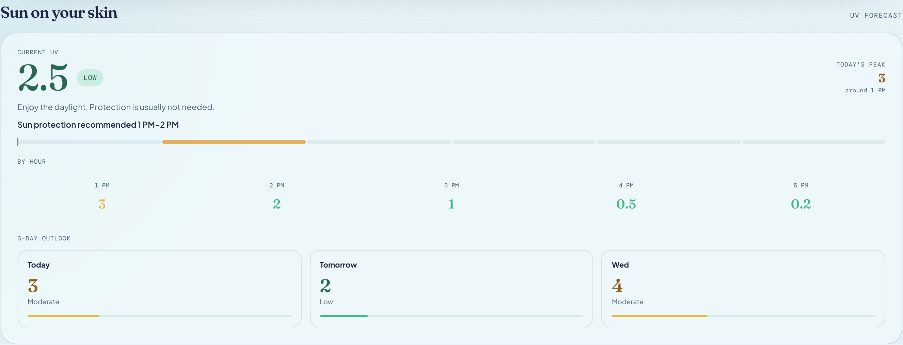
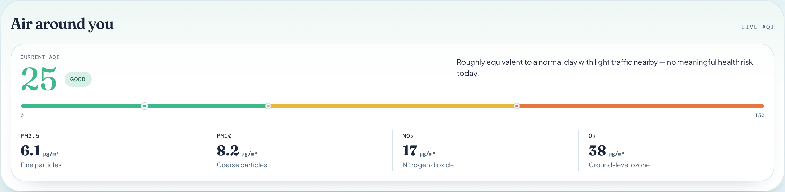

# Daymark

A calm, privacy-conscious weather PWA built with React, Vite, TypeScript, and [Open-Meteo](https://open-meteo.com).



## Overview

Daymark answers one question well — *what's the sky doing?* — without dashboards, accounts, or tracking. It is a fully client-side app: your browser talks directly to the free Open-Meteo API, nothing is stored on any server, and location is only used when you ask for it.

## Features

- **Current weather** — temperature, feels-like, condition, and plain-English "umbrella?" / "sunglasses?" advice cards
- **Hourly outlook** — the next 12 hours with icons, temperatures, and rain chance
- **3-day forecast** — highs, lows, and precipitation per day
- **Sun on your skin** — current UV index with a protection range gauge, hourly UV strip, and a 3-day outlook
- **Air around you** — live US AQI with WHO/city comparison markers, pollutant breakdown (PM2.5, PM10, NO₂, O₃), and plain-English context
- **Regional comparison (UK only)** — a nearby UKV model grid point compared against the regional forecast; hidden where that model is not valid
- **Dew point & comfort** — alongside humidity, because dew point is what your skin actually feels
- **Location search** — switch to any city or town using Open-Meteo geocoding, with region/country disambiguation
- **Severe weather risk** — forecast-derived wind, rain, snow, thunderstorm, heat and cold risks, clearly labelled as *not* official warnings
- **Voice** — *Hear today* reads the briefing aloud; *Ask Daymark* answers spoken weather questions using the browser Web Speech APIs (no cloud TTS)
- **English, French and Spanish** — locale-aware UI, guidance, alerts and voice, defaulting to the browser language
- **°C / °F toggle**, graceful offline shell, and installable as an app (PWA)

## Interface

The design is editorial rather than dashboard-like — a serif-led hero with plain-English advice cards, matched forecast cards, and compact feature sections that each keep their own personality.

**Responsive, mobile-first** — the full page at 390px:

<details>
<summary><strong>View the full mobile page</strong></summary>

<p align="center"></p>

</details>

**Matched forecast pair** — the next five hours beside the 3-day outlook:



**Sun on your skin** — current UV with advice, today's peak, the next five hours, and a 3-day outlook:



**Air around you** — live AQI with plain-English context and pollutant readings:



## Tech stack

- [React 19](https://react.dev) + [TypeScript](https://www.typescriptlang.org) + [Vite 7](https://vite.dev)
- [Tailwind CSS 4](https://tailwindcss.com) with a hand-written design layer (Fraunces, Plus Jakarta Sans, DM Mono — self-hosted)
- [Zod](https://zod.dev) for runtime validation of every API response
- [wouter](https://github.com/molefrog/wouter) for routing and [Radix](https://www.radix-ui.com) primitives
- Typed English/French/Spanish dictionaries (no i18n dependency) and the browser Web Speech APIs for optional voice
- pnpm workspaces; Vitest + Playwright for tests

## Architecture

Daymark is a **client-side single-page app + PWA**. There is:

- **No backend, no database, no server code** — the repository ships static files only
- **No user accounts, no analytics, no telemetry, no cookies**
- One workspace package that matters: `artifacts/weather-app` (plus `artifacts/mockup-sandbox`, a local-only design tool that is never deployed)

All weather logic lives in [`artifacts/weather-app/src/lib/weather.ts`](artifacts/weather-app/src/lib/weather.ts): typed Open-Meteo clients, permissive-but-strict Zod schemas at the network boundary, 10-second fetch timeouts, and the formatting/categorisation helpers. Building on that: `weather-alerts.ts` is a pure forecast-risk engine, `weather-intents.ts` is a language-independent intent/response layer shared by voice, `i18n.ts` + `locales/` hold the typed translations, and `voice-browser.ts` / `voice-input-browser.ts` are framework-free browser speech adapters. UI components live in `src/components/weather/`.

## Privacy approach

- **Geolocation is never requested on load.** The app opens on a default location (London) and only touches the Geolocation API when you press *Use my location*
- **Coordinates are rounded to 2 decimals (~1 km) before leaving your device**, then sent only to Open-Meteo endpoints
- **Nothing else is persisted** — only your language preference (`daymark.locale`) is kept locally; no location, queries, transcripts, cookies, IndexedDB or other storage
- **Public privacy policy** — a full policy is part of the app at `/privacy` (English), `/fr/privacy` (French) and `/es/privacy` (Spanish); the footer links to the version matching the interface language. It documents the actual data flows, local-storage behavior and third-party services described above
- **No analytics or third-party trackers** — weather and location-search data go only to the Open-Meteo API hosts (plus the attribution link in the footer); optional voice input is handled by your browser or device and may use its speech service, but Daymark itself never stores transcripts
- Fonts are self-hosted; no CDN font requests

## Weather data source

All forecast, air-quality, and geocoding data comes from [Open-Meteo](https://open-meteo.com) — free for non-commercial use, no API key required. Daymark requests only what it renders and caches nothing on disk.

## PWA / offline behavior

Daymark installs as a standalone app (manifest + icons included). A minimal service worker caches the **app shell only** — HTML, hashed JS/CSS, fonts, and icons — so the app opens offline. Live weather always comes from the network: Open-Meteo responses are never cached, and a cold network shows a friendly error with retry rather than stale data. Updates follow network-first navigation with a versioned cache, so users are never trapped on an old build.

## Local development

Requires [Node](https://nodejs.org) and [pnpm](https://pnpm.io). **Node 24 is the CI-tested runtime**; Node 20+ generally works, but local Node 26 is not the compatibility baseline.

```bash
pnpm install          # frozen lockfile enforced
pnpm --filter @workspace/weather-app run dev     # http://localhost:5173
```

Replit injects `PORT`/`BASE_PATH` in workspaces; locally they default sensibly (`5173`, `/`).

## Build

```bash
pnpm run build        # typecheck + build all packages
```

Output lands in `artifacts/weather-app/dist/public` — deploy it to any static host. `public/_headers` ships a production security-header set (CSP, HSTS, etc.) for hosts that honour it (Cloudflare Pages, Netlify); configure the same headers manually on hosts that don't.

## Android app (Capacitor shell)

The Android build wraps the same web bundle in a Capacitor shell
(`artifacts/weather-app/android`) with a native `DaymarkVoice` plugin: the
bundled Kokoro model and `bm_fable` voice run fully on-device (streaming
AudioTrack) for English narration; French/Spanish use Android system TTS, and
the browser build keeps Web Speech. The legacy TWA project is preserved at
`android/` as the rollback point.

```bash
cd artifacts/weather-app
pnpm exec cap sync android
cd android
JAVA_HOME=$(/usr/libexec/java_home -v 21) ./gradlew :app:assembleRelease :app:bundleRelease
```

See [docs/architecture/capacitor-migration.md](docs/architecture/capacitor-migration.md) for the architecture, plugin API, lifecycle and release details.

## Test

```bash
pnpm --filter @workspace/weather-app run test         # Vitest unit suite (214 tests)
pnpm --filter @workspace/weather-app run test:e2e     # Playwright browser suite (133 tests)
```

The e2e suite runs against a production build served by `vite preview`, mocks Open-Meteo traffic, and covers function, responsive widths (320–1440), axe-core accessibility, geolocation privacy (including wire-level coordinate rounding), failure paths, the service worker, the served security headers, location search, voice input/output, severe-weather alerts and the English/French/Spanish interface.

## Security

See [SECURITY.md](SECURITY.md). In short: minimal attack surface (9 runtime dependencies), every external response runtime-validated, a strict CSP (`default-src 'none'`, `script-src 'self'`), and no secrets anywhere in the client — there are none to leak.

## Project structure

```
artifacts/
  weather-app/            production React/Vite app (SPA + PWA)
    public/               manifest, service worker, icons, _headers
    src/lib/weather.ts    API boundary + Zod schemas + location-safe time helpers
    src/lib/weather-alerts.ts   forecast-derived risk engine (not official warnings)
    src/lib/weather-intents.ts  stable intent IDs + response layer (voice/agents)
    src/lib/voice-*.ts    browser speech playback + recognition adapters
    src/lib/i18n.ts
    src/locales/          EN / FR / ES typed dictionaries
    src/hooks/            locale + voice React bindings
    src/components/       UI components
    src/fonts/            self-hosted fonts + licences
    tests/e2e/            Playwright suite
    android/              production Capacitor Android shell
      app/                Capacitor application module
      daymark-voice/      native DaymarkVoice plugin (Kokoro, local TTS)
  mockup-sandbox/         local design sandbox (never deployed)
android/                  frozen TWA/Bubblewrap rollback project (see android/README.md)
  kokoro-poc/             shared Kokoro Rust/JNI source + fetch/build scripts
docs/                     architecture, release audit, README screenshots
scripts/                  workspace tooling
```

## Known limitations

- Unit preference (°C/°F) is not persisted across reloads (the language preference is)
- The Regional comparison uses the UKV model and is hidden outside the UK/near continent, where that model is not valid
- Severe-weather risks are forecast-derived Daymark estimates, **not** official warnings
- Voice input/output require browser Web Speech support and matching platform voices; unsupported browsers hide those controls
- On Android, English narration uses the bundled local Kokoro voice (offline); French/Spanish use the device TTS engine, which needs the matching voice data installed
- The Android shell currently bundles the arm64-v8a Kokoro library only
- Air-quality "nearby sensor" comparison is not yet wired to a sensor network; the regional forecast is shown
- The very first reload immediately after a service-worker update may briefly miss the offline shell (self-heals on the next reload)

## License

[MIT](LICENSE). Fonts are licensed under the SIL Open Font License 1.1 (see [`artifacts/weather-app/src/fonts/LICENSE.md`](artifacts/weather-app/src/fonts/LICENSE.md)). Weather data by [Open-Meteo](https://open-meteo.com) (CC BY 4.0 attribution requested for non-commercial use).

## Contributing

Issues and pull requests are welcome. Please keep the client-only architecture: no backend, no tracking, no new third-party network origins without discussion.
